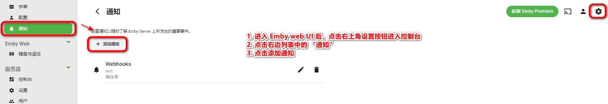
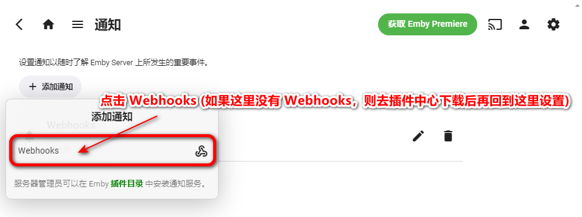
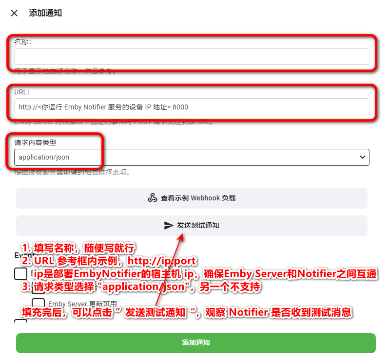
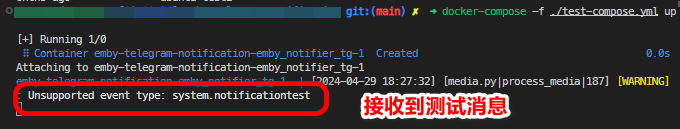
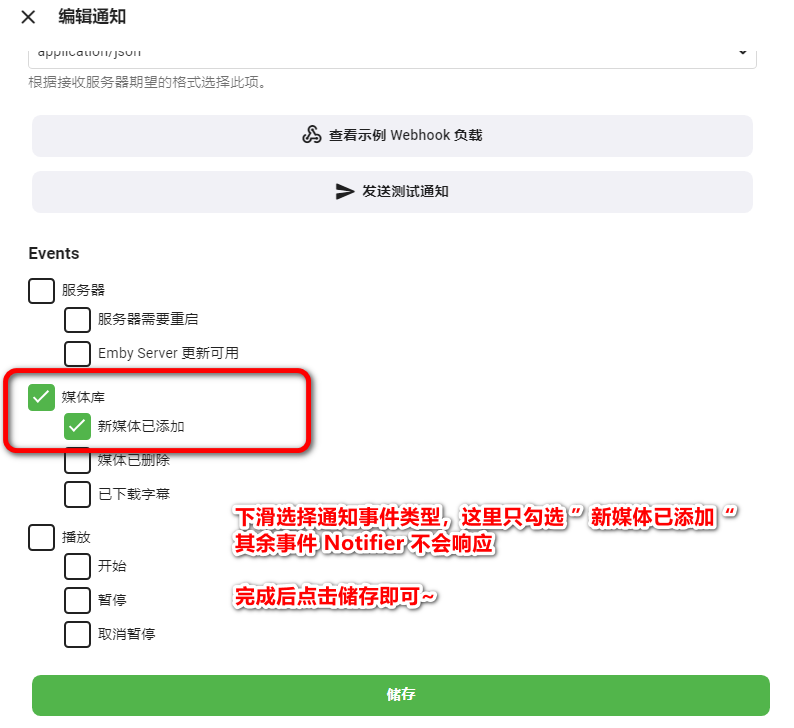
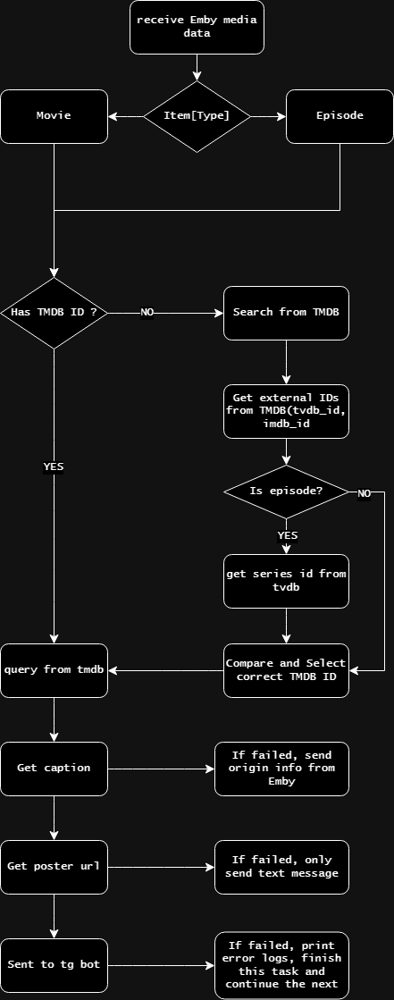

# Emby Notifier

> 这是另一个项目 [watchdog_for_Emby](https://github.com/Ccccx159/watchdog_for_Emby/tree/main) 的最新优化版本，取消了 nfo 文件的监视依赖，该版本不再需要手动设置媒体库路径，对通过网盘挂载生成的媒体库更加友好~


## Emby Server 版本 (重要！！！)

<font color=red>**4.8.0.80 及更新版本的 Emby Server！！！**</font>

本项目是基于 Emby Server 官方插件 Webhooks 实现的，在 4.8.0.80 版本以前需要激活 Emby Premiere 才能使用 Webhooks 插件。

在 4.8.0.80 版本，Webhooks 被集成到控制台 “通知” 功能中，免费用户也可使用，因此建议使用本项目的朋友更新 Emby Server 到指定版本。

<mark>需要注意的是，群晖套件中心的 Emby Server 最新在线版本为 4.7.14.0，因此需要 Emby 官方网站下载相应平台的安装包进行手动安装。</mark>

## 修订版本


| 版本 | 日期 | 修订说明 |
| ----- | ----- | ----- |
| v1.0.1 | 2024.04.30 | <li>1. 修改默认日志等级为 INFO，同步修改docker-compose模板和README；</li><li>2. 优化错误日志逻辑；</li><li>3. 新增部分 info 日志，成功处理时给出适当响应；</li><li>4. 封装搜索和校验 TMDB ID 部分代码，减少重复</li> |
| v1.0.0 | 2024.04.29 | <li>新增项目</li> |


## 简介

**Emby Notifier** 是一个基于 Emby Server Webhooks 实现的自动通知工具。Emby Server 通过 Webhooks 插件，可以在影片刮削完成后，自动推送事件到指定的 URL。本项目通过监听 Emby Server 推送的 Webhooks 事件，获取影片的基本信息，通过 TMDB 的 API 查询影片的详细信息，然后通过 Telegram Bot 推送至指定频道。

## 环境变量和服务端口

端口：8000

| 参数 | 要求 | 说明 |
| -- | -- | -- |
| TMDB_API_TOKEN | 必须 | Your TMDB API Token |
| TVDB_API_KEY | 必须 | Your TVDB API Key |
| TG_BOT_TOKEN | 必须 | Your Telegram Bot Tokne |
| TG_CHAT_ID | 必须 | Your Telegram Channel's Chat ID |
| LOG_LEVEL | 可选 | 日志等级 [DEBUG, INFO, WARNING] 三个等级，默认 INFO|
| LOG_EXPORT | 可选 | 日志写文件标志 [True, False] 是否将日志输出到文件，默认 False|
| LOG_PATH | 可选 | 日志文件保存路径，默认 /var/tmp/emby_notifier_tg |

## docker Run

~~~shell
docker run -d --name=emby-notifier-tg --restart=unless-stopped \
    -e TMDB_API_TOKEN=Your_TMDB_API_Token \
    -e TVDB_API_KEY=Your_TVDB_API_Key \
    -e TG_BOT_TOKEN=Your_Telegram_Bot_Token \
    -e TG_CHAT_ID=Your_Telegram_Chat_ID \
    -p 8000:8000 \
    b1gfac3c4t/emby_notifier_tg:latest
  
~~~

## docker-compose

```yaml
version: '3'
services:
  emby_notifier_tg:
    build:
      context: .
      dockerfile: dockerfile
    image: b1gfac3c4t/emby_notifier_tg:latest
    environment:
      - TZ=Asia/Shanghai
      # 这里所有的环境变量都不要使用引号
      # 必填参数
      - TMDB_API_TOKEN=<Your TMDB API Token>
      - TVDB_API_KEY=<Your TVDB API Key>
      - TG_BOT_TOKEN=<Your Telegram Bot Tokne>
      - TG_CHAT_ID=<Your Telegram Channel's Chat ID>
      # 可选参数
      - LOG_LEVEL=INFO # [DEBUG, INFO, WARNING] 三个等级，默认 INFO
      - LOG_EXPORT=False # [True, False0] 是否将日志输出到文件，默认 False
      - LOG_PATH=/var/tmp/emby_notifier_tg/ # 默认 /var/tmp/emby_notifier_tg/
    network_mode: "bridge"
    ports:
      - "8000:8000"
    restart: unless-stopped
```

```bash
docker-compose up -d
```

## Emby Server 设置

1. 打开 Emby Server 控制台，点击左侧菜单栏的 “设置” -> “通知” -> “添加 Webhooks”

    

    

2. 在弹出的对话框中，填写 Webhooks 的 URL，例如：`http://192.168.1.100:8000`，选择数据类型为 `application/json`

    

3. 点击 “发送测试通知” 按钮，观察 Notifier 的日志输出，如果输出了测试通知的信息，说明 Webhooks 设置成功

    

    Notifier 日志中出现以下信息，说明 Webhooks 设置成功
    ```shell
     [WARNING] : Unsupported event type: system.notificationtest
    ```

4. 选择通知事件：媒体库 -> 新媒体已添加，点击保存

    

## 媒体信息检索流程




## 局限性

Emby Server 的新媒体添加事件的触发时机受限于对新增文件的监视方式和扫描媒体库的频率，如果 Emby Server 触发新媒体添加事件，则 Notifier 也就无法推送通知。

## 效果展示

电影：


剧集：


## 参考文档

+ tmdb api 文档：https://developers.themoviedb.org/3
+ telegram bot api 文档：https://core.telegram.org/bots/api