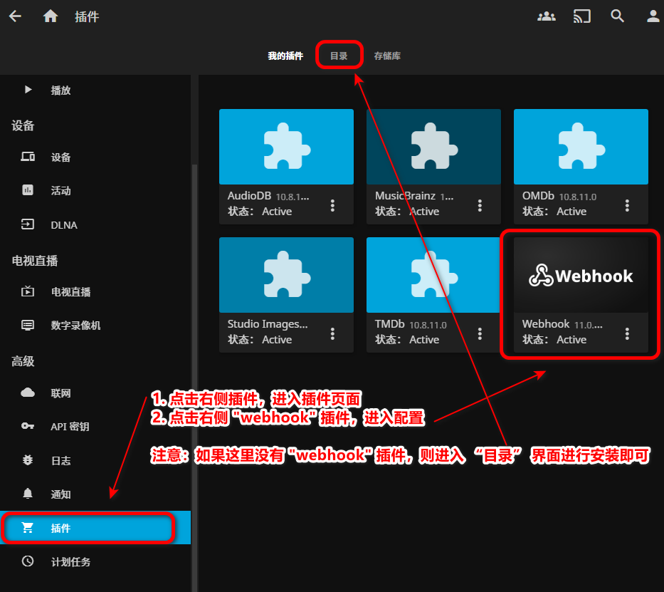
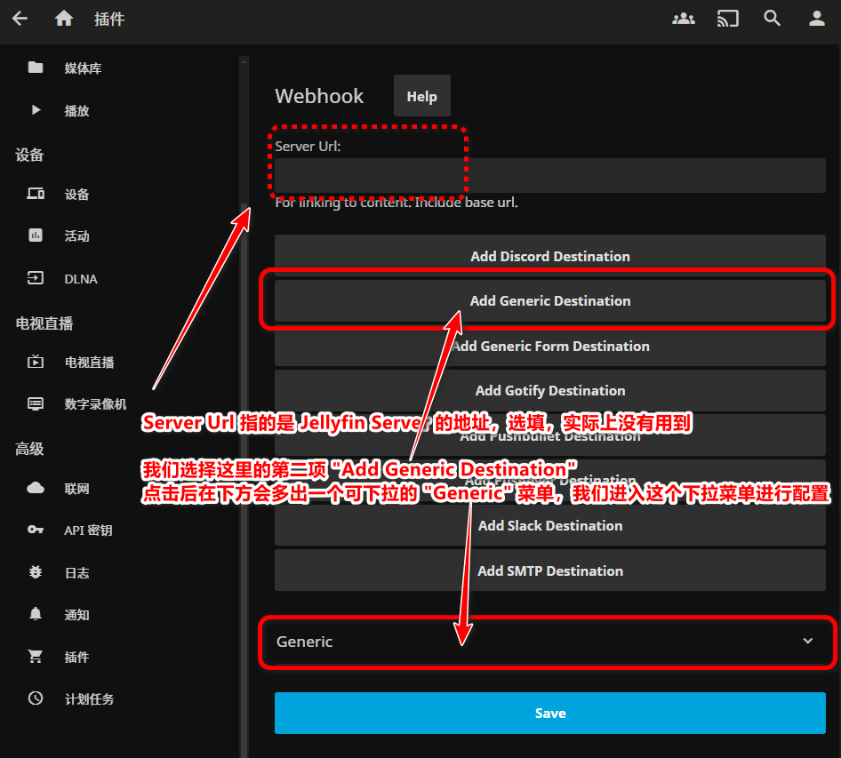
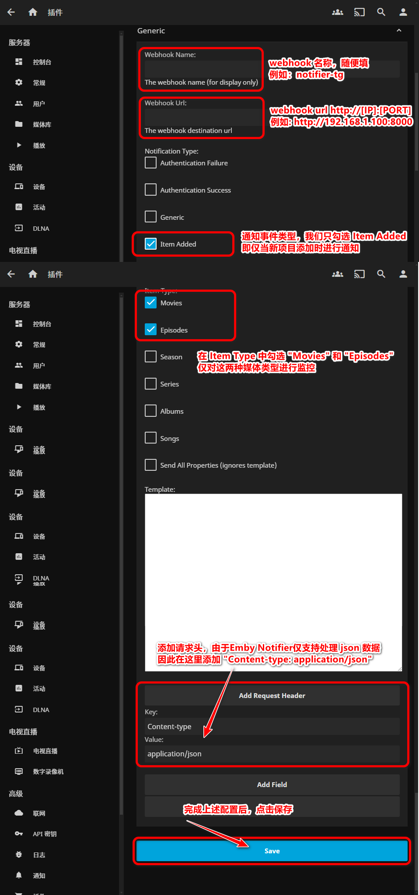
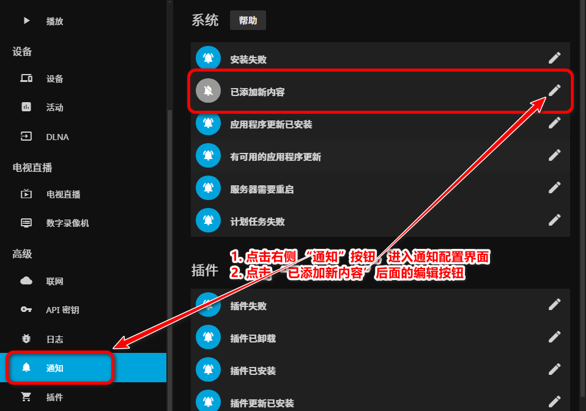
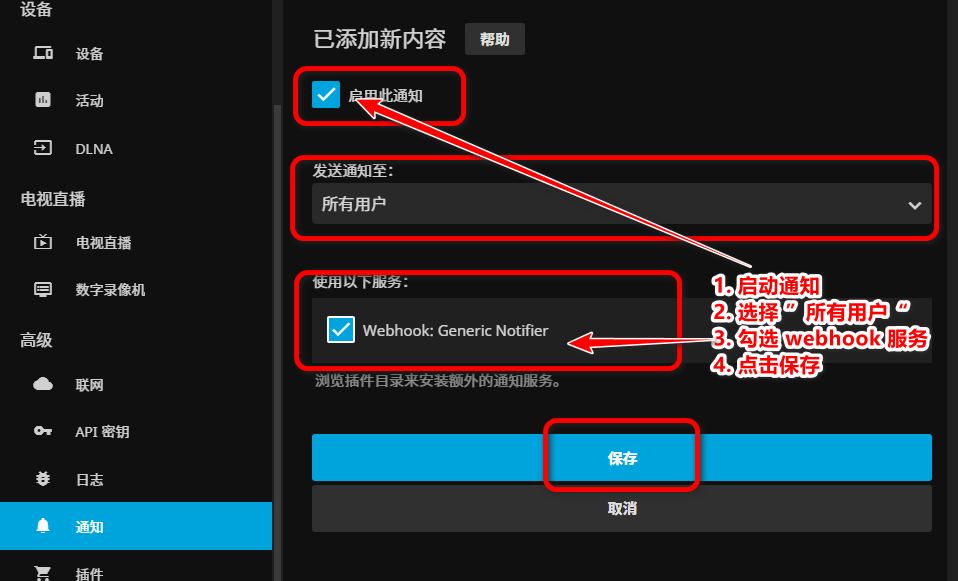

# Emby Notifier

> 这是另一个项目 [watchdog_for_Emby](https://github.com/Ccccx159/watchdog_for_Emby/tree/main) 的最新优化版本，取消了 nfo 文件的监视依赖，该版本不再需要手动设置媒体库路径，对通过网盘挂载生成的媒体库更加友好~

## 重大更新！！！

v2.0.0 版本现已支持 Jellyfin Server！！！详细配置请参看章节 [Jellyfin Server 设置](#jellyfin-server-设置)

## Emby Server 版本 (重要！！！)


<font color=red>**4.8.0.80 及更新版本的 Emby Server！！！**</font>

本项目是基于 Emby Server 官方插件 Webhooks 实现的，在 4.8.0.80 版本以前需要激活 Emby Premiere 才能使用 Webhooks 插件。

在 4.8.0.80 版本，Webhooks 被集成到控制台 “通知” 功能中，免费用户也可使用，因此建议使用本项目的朋友更新 Emby Server 到指定版本。

<mark>需要注意的是，群晖套件中心的 Emby Server 最新在线版本为 4.7.14.0，因此需要 Emby 官方网站下载相应平台的安装包进行手动安装。</mark>

## 修订版本


| 版本 | 日期 | 修订说明 |
| ----- | ----- | ----- |
| v3.0.3 | 2024.09.21 | <li>1. 修复同时配置 tg 和微信时，由于 tg 推送失败导致微信不推送的问题</li>|
| v3.0.2 | 2024.08.18 | <li>1. 修复 emby 推送的媒体信息缺少 server url 导致字段缺失报错，默认填充 <https://emby.media>；</li>|
| v3.0.1 | 2024.08.02 | <li>1. 去除企业微信"推送用户"参数的校验，默认推送给虽有用户；</li><li>2. 修复测试消息推送失败的问题</li><li>3. 新增 aarch64 dockerfile 支持</li>|
| v3.0.0 | 2024.07.29 | <li>1. 新增企业微信支持；</li>|
| v2.2.3 | 2024.06.12 | <li>1. 兼容高版本 Emby Server 新增媒体事件通知的处理，包括修复 PremiereDate 和 剧集的 episode tmdb id 等兼容性导致的消息推送失败问题；</li><li>2. 修复 tvdb_api 中一处日志等级错误；</li>|
| v2.2.2 | 2024.06.11 | <li>1. 修复 tvdb id 环境变量为空时校验失败的问题；</li><li>2. 修复 chat id 被设置为用户 id 导致的校验失败问题</li> |
| v2.2.1 | 2024.05.30 | <li>1. 修复非首季剧集搜索失败问题。TMDB /search/tv 接口参数 "first_air_date_year" 特指 “首季” 的初次发布年份，后续季发布年份不同于首季时，使用该字段出现搜索失败的情况，将搜索参数修改为 "year" 修复该问题。</li> |
| v2.2.0 | 2024.05.24 | <li>1. 增加必填参数有效性校验，基于 TMDB authorization 和 tgbot getMe method 等方法进行认证，通过后才启动服务</li><li>2. 将 TVDB_API_KEY 修改为 “可选”，兼容性修改。使用过程中出现 Server 的通知消息中无 ProviderIds 信息，tvdb api 请求返回 502 等情况，导致服务不够稳定，为了提高兼容性，将 TVDB_API_KEY 设置为可选配置，若配置，则对于有 tvdb_id 且无 tmdb_id 的影片可以有效提高信息检索准确性</li><li>3. 优化部分 Requests 请求的异常处理</li> |
| v2.1.0 | 2024.05.22 | <li>1. 新增测试 message 推送，当Emby Server发送测试通知时，将消息推送到对应 tg chat。仅输出日志容易导致使用者误解为无响应</li><li>2. 修改 README 中对 TMDB_API_TOKEN 的中文解释为 "API 读访问令牌"</li><li>3. tgbot sendmessage 方法新增异常信息打印</li><li>4. 修复日志文件默认路径错误，并当设置LOG_EXPORT=True时，将欢迎信息同步写入日志文件</li> |
| v2.0.0 | 2024.05.17 | <li><mark>1. 支持 Jellyfin Server</mark></li><li>2. 优化部分日志信息，方便调试和跟踪问题</li><li>3. 优化逻辑，当无法匹配id时，默认使用第一个搜索结果，避免因为id缺失导致无结果（对于较少部分id缺失的媒体文件，由于缺少匹配和校验机制，可能出现推送结果与实际影片不符现象）</li> |
| v1.0.4 | 2024.05.16 | <li>1. 推送消息新增 “服务器名称” tag，当Notifier服务被应用于多个 server 时，易于区分</li><li>2. tgbot 推送失败时，增加日志输出 api 返回内容</li> |
| v1.0.3 | 2024.05.08 | <li>1. 修复环境变量校验中的一处环境变量名称笔误，该错误会导致无法正常启动服务</li><li>2. dockerfile 增加环境变量PYTHONUNBUFFERED=1，避免因日志缓存无法即时获取信息</li> |
| v1.0.2 | 2024.05.08 | <li>1. 修复当 LOG_LEVEL 未设置时，默认等级 INFO 不生效，仍然维持 WARNING 等级的错误；</li><li>2. 新增 welcome 日志，输出项目名称，作者，版本等信息；</li><li>3. 新增环境变量校验，当必选项未设置时，将不会启动服务;</li> |
| v1.0.1 | 2024.04.30 | <li>1. 修改默认日志等级为 INFO，同步修改docker-compose模板和README；</li><li>2. 优化错误日志逻辑；</li><li>3. 新增部分 info 日志，成功处理时给出适当响应；</li><li>4. 封装搜索和校验 TMDB ID 部分代码，减少重复</li> |
| v1.0.0 | 2024.04.29 | <li>新增项目</li> |


## 简介

**Emby Notifier** 是一个基于 Emby Server Webhooks 实现的自动通知工具。Emby Server 通过 Webhooks 插件，可以在影片刮削完成后，自动推送事件到指定的 URL。本项目通过监听 Emby Server 推送的 Webhooks 事件，获取影片的基本信息，通过 TMDB 的 API 查询影片的详细信息，然后通过 Telegram Bot 推送至指定频道。

## 环境变量和服务端口

端口：8000

| 参数 | 要求 | 说明 |
| -- | -- | -- |
| TMDB_API_TOKEN | 必须 | TMDB API 读访问令牌（API Read Access Token） |
| TVDB_API_KEY | 可选 | Your TVDB API Key |
| TG_BOT_TOKEN | 必须 | Your Telegram Bot Token |
| TG_CHAT_ID | 必须 | Your Telegram Channel's Chat ID |
| LOG_LEVEL | 可选 | 日志等级 [DEBUG, INFO, WARNING] 三个等级，默认 INFO|
| LOG_EXPORT | 可选 | 日志写文件标志 [True, False] 是否将日志输出到文件，默认 False|
| LOG_PATH | 可选 | 日志文件保存路径，默认 /var/tmp/emby_notifier_tg |
| WECHAT_CORP_ID | 可选 | （企业微信）企业 id |
| WECHAT_CORP_SECRET | 可选 | （企业微信）应用的凭证秘钥 |
| WECHAT_AGENT_ID | 可选 | （企业微信）应用 agentid |
| WECHAT_USER_ID | 可选 | （企业微信）用户 id，默认为“@all” |

## docker Run

~~~shell
docker run -d --name=emby-notifier-tg --restart=unless-stopped \
    -e TMDB_API_TOKEN=Your_TMDB_API_Token \
    -e TVDB_API_KEY=Your_TVDB_API_Key \
    -e TG_BOT_TOKEN=Your_Telegram_Bot_Token \
    -e TG_CHAT_ID=Your_Telegram_Chat_ID \
    -p 8000:8000 \
    b1gfac3c4t/emby_notifier_tg:latest
  
~~~

## docker-compose

```yaml
version: '3'
services:
  emby_notifier_tg:
    build:
      context: .
      dockerfile: dockerfile
    image: b1gfac3c4t/emby_notifier_tg:latest
    environment:
      - TZ=Asia/Shanghai
      # 这里所有的环境变量都不要使用引号
      # 必填参数
      - TMDB_API_TOKEN=<Your TMDB API Token>
      - TG_BOT_TOKEN=<Your Telegram Bot Tokne>
      - TG_CHAT_ID=<Your Telegram Channel's Chat ID>
      # 可选参数
      - TVDB_API_KEY=<Your TVDB API Key>
      - LOG_LEVEL=INFO # [DEBUG, INFO, WARNING] 三个等级，默认 INFO
      - LOG_EXPORT=False # [True, False0] 是否将日志输出到文件，默认 False
      - LOG_PATH=/var/tmp/emby_notifier_tg/ # 默认 /var/tmp/emby_notifier_tg/
      - WECHAT_CORP_ID=xxxxx      # 企业微信：企业 id
      - WECHAT_CORP_SECRET=xxxxxx # 企业微信：应用凭证秘钥
      - WECHAT_AGENT_ID=xxxxx # 企业微信：应用 agentid
      - WECHAT_USER_ID=xxxxxx # 企业微信：用户 id，不设置时默认为 “@all”
    network_mode: "bridge"
    ports:
      - "8000:8000"
    restart: unless-stopped
```

```bash
docker-compose up -d
```

## Emby Server 设置

1. 打开 Emby Server 控制台，点击左侧菜单栏的 “设置” -> “通知” -> “添加 Webhooks”

    

    

2. 在弹出的对话框中，填写 Webhooks 的 URL，例如：`http://192.168.1.100:8000`，选择数据类型为 `application/json`

    

3. 点击 “发送测试通知” 按钮，观察 Notifier 的日志输出，如果输出了测试通知的信息，说明 Webhooks 设置成功

    

    Notifier 日志中出现以下信息，说明 Webhooks 设置成功
    ```shell
     [WARNING] : Unsupported event type: system.notificationtest
    ```

4. 选择通知事件：媒体库 -> 新媒体已添加，点击保存

    

## Jellyfin Server 设置

1. 打开 Jellyfin Server 控制台，点击左侧菜单栏的 “插件”，点击 “Webhooks” 插件进行配置

    

2. 添加类型为 "Generic Destination" 的 webhook

    

3. 配置 Generic Destination
  
    

4. 点击左侧 “通知”，进入通知配置界面

    

5. 启用通知

    

## 媒体信息检索流程


## 局限性

Emby Server 的新媒体添加事件的触发时机受限于对新增文件的监视方式和扫描媒体库的频率，如果 Emby Server 触发新媒体添加事件，则 Notifier 也就无法推送通知。

## 效果展示

电影：


剧集：


## 参考文档

+ tmdb api 文档：https://developers.themoviedb.org/3
+ telegram bot api 文档：https://core.telegram.org/bots/api